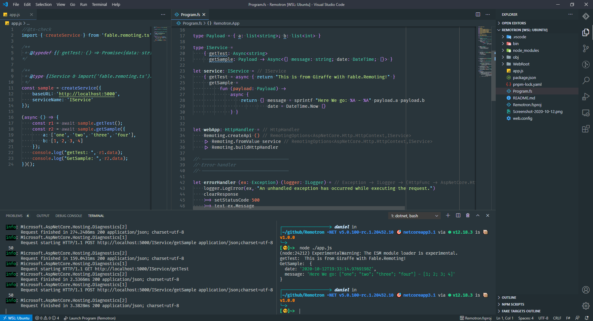

# Fable.Remoting.Ts Sample

Sample using [fable.remoting.ts] and [Fable.Remoting]

this sample was made with 
`•NET v5.0.100-rc.1.20452.10 🎯 net5.0 via ⬢ v12.18.3`

# run
- dotnet run
- node ./app.js

